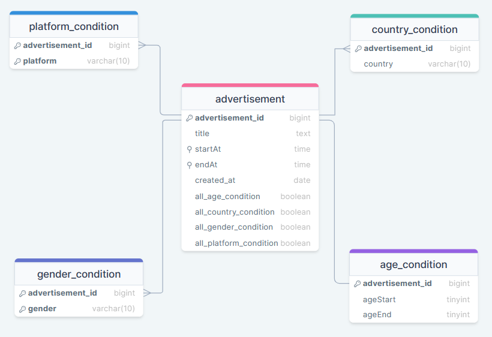

# 後端系統 - 廣告 的 獲取與投遞
## 需求分析
### 人物關係
1. 廣告投遞商
   ```
   為廣告的提供者，可以自行設計希望投遞的目標客群各種細節
   不過不會直接讓廣告商使用內部API，因為廣告宜先經過審核再由內部人員將廣告放置系統內
   ```
2. 管理者
   ```
   為系統管理者，預想狀態為廣告投遞商與管理者進行討論，
   確認投遞廣告項目與目標受眾後，將該項廣告資訊加入系統當中
   ```
3. 廣告接收者
   ```
   為一般使用人員，預想狀態透過查詢獲取其相關的廣告內容
   ```

### 需求項目
1. 新增廣告
    * ⽤於產⽣管理廣告資源 (僅為CREATE)
    * 使⽤ RESTful
    * 廣告屬性
        * 標題 Title
        * 開始與結束時間 StartAt、EdnAt
        * 年齡、性別、國家、平台 (Age、Gender、Country、Platform) (均為多選)
2. 查詢廣告
    * 列出符合條件的活躍廣告 (StartAt < NOW < EndAt)
    * 使⽤ RESTful
    * 具分頁功能 透過 offset & limit
    * 查詢參數 : Age、Gender、Country、Platform

```
備註 :
    RESTful 為一種 API 設計風格(路由即資源) 而通常使指 http 伺服器。
    因此該專案使用 http 作為整體後端的溝通協議。
```
```
備註 :
    在新增廣告環節當中，若是標題、開始時間、結束時間等等資訊都相同，是否該視為同一筆廣告。
    這項資訊關連到後續的資料庫設計。
    雖然題意無特別強調，不過我的答案是否定。我認為可能出現恰好資訊完全相同不同公司的狀態。
    為此呼應我後續的資料庫設計。
```

### 效能規範
Q、提供 Public API 能超過 10,000 Requests Per Second 的設計

首先對於每秒10000則請求，相信當中**勢必會出現續多相同條件請求**，
因此系統宜採用**快取服務以達到同時更多相同的請求**，當中快取位置可放於反向代理伺服器或是後端系統。

再來假設已經對於資料獲取方式做優化仍無法達到要求，則應採取"**垂直擴展**"或是"**水平擴展**"。
1. 垂直擴展 則需要行能更強大的主機，於軟體設計較無法控制
2. 水平擴展 則需要使用分散式技術，可以使用kubernetes的方式進行部屬，並連接多台主機以提升效能

最後對於系統使否能承受指定流量仍需要做測試採能知曉，所以必須撰寫其相關腳本，達到流量要求並且產生隨機的詢問內容。
(此項專案使用我個人熟悉的K6作為負載測試)

### 其餘規範

* 可以參考 API 範例，也能⾃⾏設計 API
    * 會基於題目所規範的 API 進行設計


* 如果需要，請隨意使⽤任何外部函式庫
    * 基於安全考量與各項題目要求會使用 gin 作為伺服器框架，同時會使用多種連接各項資料庫的相關套件。


* ⾃由選擇外部儲存⽅式
    * 對於各項資訊儲存會採用不同方式


* 請對這兩組 API 進⾏合理的參數驗證和錯誤處理
    * 為此在 middleware 時會建立其相關檢查機制，並對其做相關的回覆。


* 請撰寫適當的 test
    * 為此專案做單元測試、API測試、各項負載測試，其在文本結尾顯示成果(測試代碼覆蓋率、壓力測試結果...)


* 不需要考慮⾝份驗證
    * 好的。表示所有人均可透過API進行互動。


* 同時存在系統的總活躍廣告數量 (也就是 StartAt < NOW < EndAt) < 1000
    * 可以在投遞廣告時進行檢查，若是該時段數量已超過1000則拒絕該廣告投遞請求


* 每天 create 的廣告數量 不會超過 3000 個
    * 為此可以為每個廣告建立created_at屬性，用以檢查當日投遞廣告數量，同時為提高效能可以將今日以投遞數量放置快取當中，整體規畫路徑設計如下，
        1. 進入資料庫 再次檢查今日投遞數量
        2. 若已超過3000則廣告，則拒絕該項請求，反之則新增該項請求內容
        3. 新增完後會再次確認資料庫內本日的廣告數量，確保每日不會新增超過 3000 則廣告


* 請在 Readme 中描述想法和設計上的選擇
    * 好的，我會盡可能完整地闡述我的選擇及設計方針

### 附加功能

Q、對於達到題目要求的設計

對於題目規範，若欲達成最合適設計，最佳解法為設計實驗並觀察其狀態。

為此必須要建立其觀測系統以記錄並觀察數據，因此會於外增加Grafana、Prometheus、Influxdb等等工具，以觀測實驗成效。

## API 設計

由於是採用 RESTful 設計風格進行設計，因此使用 OPENAPI(舊為Swagger) 作為 API 規範文件非常合適。

當服務器啟動時 可以在 http://127.0.0.1:8080/api/v1/docs 中查詢

[API 文檔內容](assets/docs/api_specification.yaml)


### API 設計緣由
大部分設計都遵循，題目規定。

不過像是在獲取廣告時並無特別強調其餘屬性使否一定要有資料(age, gender, country, platform)
因此我的理解為 以上選項均為可選條件 (若無則不受限制)

```
備註 :
    此次開發採用文檔先行的方式，先設計文檔再撰寫後端程序內容。
    
    在設計當中
    1. 提供重複參數視為錯誤 如 ?age=10&age=24
    2. 提供參數空白是為錯誤 如 ?age=&platform=ios (若不規範年齡，正確為 ?platform=ios 直接不填) 
    3. 不論是 新增或是獲取廣告 content-type 均需設定為 application/json(與題目給予範例相同)
    4. 在投遞廣告請求中，對於條件不得重複 如 gender = ["M","M"] 則視為違法請求
    5. 新增廣告時，若超過本日限制則回傳 429 (Status too many request) 代表需要明日再新增
    6. 新增廣告時，若超過時段限制則回傳 409 (Status conflict) 代表需更改廣告宣傳時間
```

## 資料庫設計
### Schema Diagram 設計

```
備註 :
    在最開始我並沒有選擇新增 AllCondition 那系列屬性，
    但是後來思考認為假設當前 age 最低為 1 最高為 100，無限制 等同時 限制於 1~100 嗎?
    
    我的答案是否定，我認為尤其當未來系統假設更改限制了改成 1~120
    如此一來原先只要 1~100 與 無限制的人就分不清了。
    同樣的道理適用於平台、性別、國籍。
    
    所以最後新增一系列 AllCondition 屬性。
```
```
備註 :
    透過schema diagram實體的關聯性並不大，
    (雖然可以透過再增加其他實體以使advertisement成多對多關係，不過我認為意義並不大因此未採用)
    由此也可以嘗試使用 no-sql 的方式進行儲存(最後透過實驗才能得知何者才是相對最好的實現)
```
### Document Storage 設計
```
{
    "id": "Example Id",
    "title": "Example Title",
    "createdAt" : ISODate("2023-01-01T00:00:00Z"),
    "timeRange": {
        "startAt": ISODate("2023-01-01T00:00:00Z"),
        "endAt": ISODate("2023-01-02T00:00:00Z")
    },
    "conditions": {
        "age": {
            "ageStart": ISODate("2023-01-01T00:00:00Z"),
            "ageEnd": ISODate("2023-01-02T00:00:00Z")
        },
        "gender" : ["M","F"],
        "platform" : ["andriod","ios","web"],
        "country" : ["TW","JP"]
    }
}
```

### Cache 設計

我有在思考對於cache設計非常重要，

首先必須了解資料是否常更動，相對擔心"**快取擊穿**"、"**快取穿透**"、"**快取雪崩**"等等問題

而這一切又與使用者習慣有很大關係，比如可能前10筆資料會大量被請求，對於不同資料當中又可以做快取分層或是預熱資訊等等

而要如何獲得數據呢? 最佳設計仍是要透過實驗或是實際於生產環境獲取相對好的實現方式。

#### Cache 需求路由
首先 哪些路由需要快取? 逐一分析
1. 獲取廣告
2. 投遞廣告

我認為前者非常需要快取而後者不需要，為何如此說呢?(坦白說這困擾我一天)

**難道放任10000併發請求 同時向投遞廣告合理嗎?**

為此在討論此問題前必須回到前方情境設計的問題，

前方已假設廣告必需先經過審核，再由內部人員進行設定。

為此我認為較不亦出現極端情況，同時快取的取消亦能確保資料的可靠性。
(避免出現資料不一而超出額度的狀況)


#### Cache 過期時間
由於我本身並未有其相關的經驗，更不是這項領域的專家(最理想狀態是實際測試加上詢問專家意見)

那該如何解決呢 ? 為此特別詢問ChatGPT(假扮該方面的專家)獲取相關意見

1. 短期快取：
   ```1分鐘到5分鐘，適用於廣告內容頻繁更新或者需要實時競價的場景。```
2. 中期快取：
   ```15分鐘到1小時，適合於廣告內容相對穩定，但仍需定期更新以反映最新廣告活動的情況。```
3. 長期快取：
   ```1小時到24小時，適用於廣告內容變化不大，或者廣告投放計劃較為長期的場景。```

最後根據我先前假設情況來看，選擇 **中期快取** 作為該系統的過期策略 **(即15分鐘到1小時)**

#### Cache 問題與解決方案

1. 快取擊穿 ```一個鍵過期的瞬間，會有大量請求前往資料庫```

   採用的解決方式 是透過 singleflight

   核心概念就是透過鎖的方式，讓多個同時通過快取(沒找到)相同的請求，僅讓一個請求進去看資料。

   同時可以設定超時時間，以避免過多請求等待過久。

   

2. 快取穿透 ```大量詢問不存在資料的請求同時打過來(快取一定查不到 所以都前往資料庫)```

   此類問題確實相當嚴重，通常可以透過 **"布隆過濾器"** 做基礎的過濾，

   不過在此專案中，問題較為單一(詢問廣告)也不想被誤判

   為此我採用的方式是 先檢查好參數再查看快取(也減少快取資料庫負擔)

   

3. 快取雪崩 ```多個鍵同時過期，導致大量請求同時前往資料庫```

   對於此類問題我採用的方式 是透過 **隨機設置過期時間** 以避免同時過期

   

#### Cache 策略
最開始對於 Cache 最開始策略是採用 整個路由(包含offset、limit) 作為 cache 的 key

| 鍵 (Key) | 值 (Value) |
|---------|-----------|
| 完整 URL  | 相對應的資料    |

後來經過基礎的實驗後(每秒 100 併發請求 持續 10 分鐘)，發現快取命中率過低(約略都落在 1% 上下)

思考後認為必須要更新快取的策略，以提升系統整體的效能。

而我便發現一個重點，(**單一時段內，請求不會超過 1000 筆**)

換句話說，在經過其他篩選條件後若不分頁，頂多也就是 1000 筆 (是相對小的數值)。

為此我打算在資料庫查詢時，不做分頁查詢。
再透過自行計算offset、limit對應的資料回傳，並且將整分資料作為快取儲存。

| 鍵 (Key) | 值 (Value) |
|---------|-----------|
| 篩選條件組合  | 整份資料      |

而獲得快取後，亦是另外再透過自行計算offset、limit對應的資料回傳。

**最後在更新快取策略後，快取命中率平均都提升到 80% 以上。**
```
備註 :
    如此的快取方式，並非在所有狀況都是最好的選擇
    主要是基於 單一時段內，請求不會超過 1000 筆 這特殊條件
    
    因此在開發時，往往都需要根據不同的業務情境做不同的選擇。
```

## 日誌管理 與 資料紀錄 設計
在日誌管理，透過 zerolog 這套件進行日誌紀錄(比 go 原生 log 還快很多)

同時透過建立 hook 的方式 將資料匯入 influxdb (時序型資料庫) 以持續地紀錄日誌

為避免斷線的狀態，還有備用方案將日誌資料存於本地，重新連線後將資料一併寫入 influxdb

其實現的方式在 [utils/logger.go](utils/logger.go) 完成了檢查連線與 logger 切換邏輯
```
備註:
    日誌作用
    1. 可以做為追蹤錯誤發生的紀錄進而去修改錯誤
    2. 紀錄相關數據(如快取命中狀況) 進而去優化系統
```
## 專案架構與系統架構設計
### 架構設計 - [階層式架構](https://en.wikipedia.org/wiki/Multitier_architecture#Three-tier_architecture)


### 階層式架構優勢
1. 關注點分離
    * Presentation layer 僅用關心請求內容是甚麼，並且回覆什麼即可。
        * 例如 從使用者請求獲得 content-type 不正確 就回傳 415、內容有誤或不完整 就回傳 400
    * Business logic layer 僅用關心其內部邏輯，拿到資料後要如何傳換運算
        * 例如 從上層獲得 廣告內文或過濾條件，詢問下層後返還資料，再將內容進行轉換還傳給上層
    * Data access layer 僅用關心與資料庫間的互動，包括各樣的 CRUD
        * 例如 從上層獲得 廣告內文或過濾條件，經過查詢資料庫再返回給上層
2. 易於重用、測試
    * 每個環節的模組，相當獨立負責事務單一(高聚合)，於相同邏輯可以直接使用
    * 此外模組間，交互明確不會參雜邏輯混合(低耦合)，方便於單一元件測試
3. 易於擴展、維護系統
    * 例如 需要優化 SQL 查詢方式時，僅需去更動 Data access layer 程式碼即可
    * 例如 指定路由 需要擴增服務時，可以增加 Business logic layer 程式碼即可

### 專案架構
```markdown
Project Architecture

├── api
│   ├── handler
│   ├── middleware
│   ├── request
│   ├── response
│   ├── routes
│
├── internal
│   ├── repository
│   ├── service
│
├── templates
│
├── test
│
├── assets
│   ├── docs
│
├── go.mod
│   ├── go.sum
│
├── main.go
```
- Presentation Layer
    - api 資料夾下，routes、handler與middleware
- Business Logic Layer
    - internal 資料夾下，service代表一系列邏輯服務
- Data Access Layer
    - internal 資料夾下，repository將與資料互動程序都放這
```
備註 :
    test 資料夾內放置 普通 API 測試 與 一系列測試計畫腳本
    templates 資料夾內放置靜態文件
    assets 資料夾內放置相關資料(與伺服器無關)
```
### 系統架構設計

1. 反向代理伺服器
   ```可以作為反向代理與附載均衡器的作用，亦可作為部分快取使用```
2. 後端伺服器
   ```主要作用為處理一系列邏輯處理，與反向代理伺服器通訊協議採用 http```
3. 系統監測系統
   ```透過 grafana、proetheus、influxdb 等等資料進行分析與呈現```
4. 快取系統
   ```透過此系統提升查詢時間，減輕查詢資料庫壓力```
5. 資料庫
   ```為實際資料存處位置```

```
備註 :
    在部署上，可先透過 docker-compose 簡易建立一個可運行的環境
    實際生產環境下，宜使用 kubernetes 的部署方式 以應付高併發、高流量的請求
    
    資料庫當中，
        在關聯式資料庫會採用主從式架構 達成讀寫分離。
        在非關聯式資料庫採用集群的方式，以提升查詢效能。
```

## 開發路上 問題 與 解決方案
### 時區管理
為何需要關心時區管理
1. Dcard 服務範圍，相當廣闊屬於國際型的服務。
2. 在投遞廣告時，可以選擇客戶國家範圍。

為此部署的機器(包含 CDN、Server、DataBase等等)很有可能跨及全球，

對於單一機器可能所屬位置不同，而擁有不同的本機時間，
因此我的解決方式是對於不論是資料庫、伺服器都先設置固定的時區時間。
### 參數統一設定
為方便擴展與修改系統

將所有參數設定放置於 [utils/parameters.go](utils/parameters.go)

將系統變數設定放置於 [utils/env.go](utils/env.go)

並且所有值的預設值 均放在檔案最上方 方便未來系統變動

### 資料庫連線 設置時區 (DSN 解析問題)
這是一個意外發現，再透過 gorm 連線時加入時區並非 LOCAL 會出現錯誤(疑似 DSN 解析問題)

為此我去搜尋相關問題解決方式 在 [Stack Overflow](https://stackoverflow.com/questions/71019353/how-to-set-default-timezone-on-gorm-time-time-data-type) 有人提出類似問題

不過在此問題中的 MYSQL 版本與此項專案差異過大，為此我再去看該問題的[解析 DSN 結果](https://go.dev/play/p/5yoEbmrPqlZ)是甚麼?

發現當前DSN解析確實出現問題，因此自己在 [utils/utils.go](utils/utils.go) 新增 GetSqlDsnLocation 方法以解決問題
### 路由參數未提供或過多
對於 獲取廣告 可以根據各種數據做條件過濾，在測試過程中發現對於一個條件過多出現該如何應付。

經過我的考慮後，認定這種行為為非法請求。

1. 若該參數不存在則認定該條件不受限制，即所有狀況都可。
2. 若參數存在且唯一，則認為該請求限制於該條件狀態。
3. 若參數存在且數量超過一個，則認為該筆請求不合哩，回傳 400 。

### 請求內容(Body)未給參數
在先前經驗中，判斷使用者未給參數的方式是 檢查參數是否為預設值。

在 go 當中存在一機制 int 預設值為 0、string 預設為空字串等等

原本都是檢查若為預設值則為為提供，經過思考後認為有些許不合理。

因此對於大部分的參數 都改用指標的型態取代掉原本單純的型別，為此就可以快速辨別究竟是沒設定還是提供為預設值。

## 流量測試
### K6 流量測試工具
K6 是一款開源、免費的負載測試工具，用於測試 Web 應用程式、API 和微服務的效能和穩定性。它以 Go 語言開發，並使用 JavaScript 編寫測試腳本。

#### 主要功能 :
* 模擬真實流量： 模擬真實流量模式，以測試系統在不同負載下的效能。
* 生成詳細報告： 詳細報告，幫助識別效能瓶頸和潛在問題。
* 易於使用： 命令列介面 易於使用。
#### 優勢 :

* 高性能： 使用單台主機生成數百萬次請求。
* 可擴展性： 部署在多台主機上，以進行更大規模的測試。
* 靈活性： 使用 JavaScript 編寫測試腳本，您可以根據需要自定義測試。

### 測試參數設定 與 測試計畫


參考於 [Grafana 與 K6 對於測試計畫的分類](https://grafana.com/load-testing/types-of-load-testing/)

```
備註 :
    鑒於本題目的情境假設下，認為新增廣告僅為是經由公司審核後呼叫(流量邏輯上不會過大)
    再者當日最多 3000 筆、同時段最多 1000 筆，在每秒 10000 則併發請求下(大部分都會拒絕 測試意義不大)
    因此該項接口需要關注的在併發請求下，是否能維持限制，會不會出現競爭導致資訊錯誤?
    (如 一日內接收超過 3000 筆請求 或是同一時段超過 1000 筆請求被接收)
    
    在 "新增廣告" 該路由重點測試 (併發請求下 時段內請求限制、每日請求限制)
    而 "獲取廣告" 則會進行下方一系列的流量測試
```

#### 冒煙測試 (smoke testing)
主要目的為測試伺服器能基本運行，為小的流量與時間。
```javascript
export const options = {
    vus: 3,
    duration: "1m"
};
```
#### 負載測試 (load testing)
主要目的為測試伺服器能運行於基本流量，為基本的流量與中等的時間。
```javascript
// 每秒 10000 則請求 持續 10 分鐘
export const options={
    scenarios: {
        contacts: {
            executor: "constant-arrival-rate",
            rate: 10000,
            timeUnit: "1s",
            preAllocatedVUs: 15000,
            duration:"10m"
        },
    }
}
```
#### 壓力測試 (stress testing)
主要目的為測試伺服器能運行於高度流量，為高度的流量與中等的時間。
```javascript
// 每秒 20000 則請求 持續 10 分鐘
export const options={
    scenarios: {
        contacts: {
            executor: "constant-arrival-rate",
            rate: 20000,
            timeUnit: "1s",
            preAllocatedVUs: 25000,
            duration:"10m"
        },
    }
}
```
#### 浸泡測試 (soak testing)
主要目的為測試伺服器能長時間運行於基本流量，為基本的流量與高等的時間。
```javascript
// 先從 每秒 100 則請求 到 每秒 10000 則請求 持續一小時 再降回 每秒 100 則請求
export const options={
    scenarios: {
        contacts: {
            executor: "ramping-arrival-rate",
            startRate: 100,
            timeUnit: "1s",
            preAllocatedVUs: 10000,

            stages: [
                { target: 10000, duration: "1m" },
                { target: 10000, duration: "1h" },
                { target: 100, duration: "1m" },
            ],
        },
    },
}
```
#### 尖峰測試 (spike testing)
主要目的為測試伺服器能短時間運行於高度流量，為高度的流量與較小的時間。
```javascript
// 在一分鐘內 快速增加至 每秒 30000 則請求
export const options={
    scenarios: {
        contacts: {
            executor: "ramping-arrival-rate",
            startRate: 100,
            timeUnit: "1s",
            preAllocatedVUs: 10000,

            stages: [
                { target: 30000, duration: "1m" },
                { target: 100, duration: "1m" },
            ],
        },
    },
}
```
#### 斷點測試 (breakpoint testing)
主要目的為測試伺服器能運行的極限流量，為超高度的流量與時間。
```javascript
// 持續增加至 每秒 10000000 則請求 在一小時內
export const options={
    stages: [
        { duration: "1h", target: 10000000 }
    ]
}
```

#### 單日限制 時段限制 腳本
單日限制 : 100 筆併發請求，共發出 3500 則 (預估為 3000 筆接受 500 筆拒絕)
```javascript
export const options = {
    vus: 100,
    iterations: 3500,
};
```
時段限制 : 100 筆併發請求，共發出 1500 則 (預估為 1000 筆接受 500 筆拒絕)
```javascript
export const options = {
    vus: 100,
    iterations: 1500,
};
```

### 測試內容設定
所謂測試便是希望能盡可能接近真實生產環境的使用，
如此一來盲目的隨機產生請求意義並不大，為此必須先進行 Dcard用戶 分析。

分析方案 :
1. 爬蟲分析
2. 現有的第三方服務分析資料

第一項方案，可以透過爬蟲的方式去獲取多個版當中的用戶資料(發文或是回覆)，
同時也可以將其活躍度作為一項參數加權，可以撈取數十萬筆資料再作抽樣分析。

優點 :
1. 資料非常接近真實使用狀態
2. 資料內容更為細節(版上活躍人數、整體分布狀態...)

缺點 :
1. 爬蟲合法性問題
2. 面對反爬蟲的問題 (我記得Dcard有使用Cloudflare，之前開無痕看西斯版被擋很多次)
3. 資料不完整問題 (無法得知使用平台、國籍、性別(如果選擇匿名)、年紀)

第二項方案，相對容易 透過其資料便能對實際狀態有基礎的理解。

為此我找到 [similarweb 對 Dcard 的 分析資料](https://www.similarweb.com/zh-tw/website/dcard.tw/)

similarweb 是對網站分析的服務 (可作為競品分析或是更種分析的工具)

以下是我根據當時所獲得的數據 (免費版本)

[用戶 國家分布 分析](https://share.similarweb.com/sharePost?params=eyJwYWdlSWQiOiJncjJ5VGlOYW1uLVZEdzVIcnlYdzkiLCJ0aXRsZSI6ImRjYXJkLnR3IFdlYiBUcmFmZmljIGJ5IENvdW50cnkiLCJkZXNjcmlwdGlvbiI6IldoaWNoIGNvdW50cmllcyBzZW50IHRoZSBtb3N0IHRyYWZmaWMgdG8gZGNhcmQudHcgbGF0ZWx5PyBXaGVyZSBpcyB0aGVpciBjb3JlIGF1ZGllbmNlIGZyb20/IExhc3QgbW9udGggVGFpd2FuIHdhcyB0aGUgdG9wIGNvdW50cnkgc2VuZGluZyBkZXNrdG9wIHRyYWZmaWMgdG8gZGNhcmQudHcgLSBjbGljayBiZWxvdyB0byBkaXNjb3ZlciBhbGwgY291bnRyaWVzIiwicmVkaXJlY3RVcmwiOiJodHRwczovL3d3dy5zaW1pbGFyd2ViLmNvbS93ZWJzaXRlL2RjYXJkLnR3LyNnZW9ncmFwaHkifQ==)


[用戶 年紀與性別分布 分析](https://share.similarweb.com/sharePost?params=eyJwYWdlSWQiOiJmVEQzbzlKM3ZhVXhJUFQ0b0JncFAiLCJ0aXRsZSI6ImRjYXJkLnR3IFdlYnNpdGUgVHJhZmZpYyBEZW1vZ3JhcGhpY3MiLCJkZXNjcmlwdGlvbiI6IkF1ZGllbmNlIGNvbXBvc2l0aW9uIGNhbiByZXZlYWwgYSBzaXRlJ3MgY3VycmVudCBtYXJrZXQgc2hhcmUgYWNyb3NzIHZhcmlvdXMgYXVkaWVuY2VzLiBkY2FyZC50dydzIGF1ZGllbmNlIGlzIDU3Ljc3JSBtYWxlIGFuZCA0Mi4yMyUgZmVtYWxlLiBUaGUgbGFyZ2VzdCBhZ2UgZ3JvdXAgb2YgdmlzaXRvcnMgYXJlIDI1IC0gMzQgeWVhciBvbGRzLiAgIiwicmVkaXJlY3RVcmwiOiJodHRwczovL3d3dy5zaW1pbGFyd2ViLmNvbS93ZWJzaXRlL2RjYXJkLnR3LyNkZW1vZ3JhcGhpY3MifQ==)


```
備註 :
    在上圖分析中，對於年齡分布並未擴及18歲以下
    為方面計算，將 18-24 修改為 0-24。
```

由於沒有平台分析， 我採用最高使用國家(臺灣)作為分析依據。

備註 :
不同國家差異很大，所以直接拿取全球市佔率可能較為不準確。像是在[該篇報導](https://applealmond.com/posts/111365)中，就強調臺灣蘋果用戶極大與其他國家大相逕庭。

我再透過 [statcounter](https://gs.statcounter.com/) 網站 根據近一年內的平台分布資料分析


```
雖然清楚像是華為想完全脫離android框架，今年也推出其新作業系統。

不過為方便計算，此處將非 Apple 以外平台視為 android 平台
```

| 平台分布 | ios     | android |
|------|---------|---------|
| 分布比例 | 59.06 % | 40.96 % |

最後則是web平台問題，儘管可以獲得像是手持裝置與桌面裝置分布比例，但是即使是透過手機仍有可能過web版本觀看，因此透過上述資料是無法做很好的預測的。

為此我的想法是 確切對於廣告投遞的定義(web平台是指僅透過桌面裝置進行的請求)。

statcounter 對於 臺灣用戶 手持裝置與桌面裝置分布比例


```
不過為方便計算

desktop 與 console 歸類於 桌面裝置

mobile 與 tablet 歸類於 手持裝置 
```

| 國家分布 | 臺灣 - TW | 香港 - HK | 美國 - US | 馬來西亞 - MY | 澳大利亞 - AU | 其他     |
|------|---------|---------|---------|-----------|-----------|--------|
| 分布比例 | 92.88 % | 3.11 %  | 1.79 %  | 0.39 %    | 0.25 %    | 1.58 % |

| 性別分布 | 男性      | 女性      |
|------|---------|---------|
| 分布比例 | 57.77 % | 42.23 % |

| 年齡分布 | 0 - 24  | 25 - 34 | 35 - 44 | 45 - 54 | 54 - 64 | 64 - 100 |
|------|---------|---------|---------|---------|---------|----------|
| 分布比例 | 19.13 % | 30.44 % | 22.93 % | 14.14 % | 8.3 %   | 5.05 %   |

| 平台分布 | web     | ios  | android |
|------|---------|------|---------|
| 分布比例 | 44.11 % | 33 % | 22.89 % |

以上便是我的分析結果，而當中的分析方式仍可優化。

## 系統成果
### 系統監控 - 每秒平均請求數

```
備註 : 
    此時基礎測試所監控資料 (每秒100則併發請求)
    左圖為流量時間變化 右圖為當前流量數值
```
### 系統監控 - CPU 使用狀態 與 系統可用空間

```
備註 : 上圖為 CPU 負載資訊 下圖為系統可用空間
```
### 系統監控 - Cache 命中次數 與 命中率

```
備註 : 
    上圖為 快取命中率 時間變化與當前數值 
    下圖為 快取命中與未命中 時間變化與當前數值
    從實驗上來看，新版快取策略 平均命中率可以達到 80% 以上
```
### 系統部署 - Docker-compose 資訊

```
備註 :
    圖片中顯示為應用程序使用的所有容器及其對應端口
```
### 系統部署 - Kubernetes 資訊


```
備註 :
    在 Kubernetes 的部署中，分為本地部署與雲端部署。
    
    在雲端部署中(如 GCP、Azure、AWS 等等)，建議採用雲端相對應資料庫。
        在雲端服務中，服務商通常會對其資料庫做多實例、讀寫分離，
        而使用者僅用當作單實例連接即可，便享有高負載、高可用

    在地端部署中，資料庫與伺服器均位於自身的伺服器，(切換至 local-kubernetes 分支)
        對於資料庫有分別多實例版本 ( Redis -> 叢集 、 MySQL -> 主從式)
        對於伺服器具有 HPA (根據流量動態調整實例數) 並且存在 Rolling Update 機制 
    
    另外在實驗中有使用 樹莓派-5 作為伺服器 使用 Kubernetes 部署
        因此還有分別撰寫 X86 與 ARM 版本
```

```
備註 :
    上圖為透過 GKE 部署的 kuberenets 叢集
        MySQL 採用 GCP 的 Cloud SQL
        Redis 採用 GCP 的 memorystore
        
        採用私人 IP 相連，叢集服務則採用 LoadBalancer 公開訪問 
```
### 單元測試 - 測試代碼覆蓋率


```
備註 : 
    在 api 與 internal 測試代碼覆蓋率都達 100%
    在 utils 當中測試代碼覆蓋率達到 93.1% (其餘代碼與資料庫連線相關)
```
### API 基礎測試 (新增與獲取廣告)


```
備註 :
    上圖為 新增廣告請求 下圖為 獲取廣告請求 
    (二者均為題目範例之請求內容)
```
### 流量測試 - 冒煙測試

### 流量測試 - 負載測試
```
備註 :
    在測試當中，發出測試請求的機器 出現系統資源不足的狀態
    有嘗試過採用 免費版 GCP 所提供 VM 進行測試仍出現系統資源不足
    可於未來提升硬體效能或是其他測試方案後，再次進行測試。
```
### 流量測試 - 壓力測試
```
備註 :
    在測試當中，發出測試請求的機器 出現系統資源不足的狀態
    有嘗試過採用 免費版 GCP 所提供 VM 進行測試仍出現系統資源不足
    可於未來提升硬體效能或是其他測試方案後，再次進行測試。 
```
### 流量測試 - 浸泡測試
```
備註 :
    在測試當中，發出測試請求的機器 出現系統資源不足的狀態
    有嘗試過採用 免費版 GCP 所提供 VM 進行測試仍出現系統資源不足
    可於未來提升硬體效能或是其他測試方案後，再次進行測試。
```
### 流量測試 - 尖峰測試
```
備註 :
    在測試當中，發出測試請求的機器 出現系統資源不足的狀態
    有嘗試過採用 免費版 GCP 所提供 VM 進行測試仍出現系統資源不足
    可於未來提升硬體效能或是其他測試方案後，再次進行測試。
```
### 流量測試 - 斷點測試
```
備註 :
    在測試當中，發出測試請求的機器 出現系統資源不足的狀態
    有嘗試過採用 免費版 GCP 所提供 VM 進行測試仍出現系統資源不足
    可於未來提升硬體效能或是其他測試方案後，再次進行測試。
```

### 併發流量測試 - 單日限制

```
備註 :
    上方綠框顯示 通過測驗(回傳值為200) 85% 共 3000 筆
    下方綠框顯示 
        總請求數量 : 3500 筆
        超過單日限制錯誤 : 500 筆
        成功增加廣告 : 3000 筆
```
### 併發流量測試 - 時段限制

```
備註 :
    上方綠框顯示 通過測驗(回傳值為200) 66% 共 1000 筆
    下方綠框顯示 
        總請求數量 : 1500 筆
        超過時段限制錯誤 : 500 筆
        成功增加廣告 : 1000 筆
```
## 自我評價 與 系統未來擴展方向

### 自我評價 - 專案特色
- [X] 設計架構 採用 分層式設計
- [X] 資料庫
    - [X] 關聯式資料庫 採用 MySQL 作為儲存方案
    - [X] 時序型資料庫 採用 InfluxDb 作為儲存方案
- [X] 快取
    - [X] 採用 redis 作為儲存方案
    - [X] 透過 singleflight 解決 快取擊穿
    - [X] 透過 隨機設置過期時間 解決 快取雪崩
    - [X] 透過 嚴格檢查參數 解決 快取穿透
- [X] 資料庫多實例版本 (主從式、哨兵式)
- [X] 運行方案
    - [X] Docker-Compose 運行腳本
    - [X] Kubernetes 運行腳本
- [X] 完整日誌紀錄方案 (InfluxDB、本地)
- [X] 監控系統 (Grafana + Prometheus) 設計

### 系統未來擴展方向

- [ ] 使用固定腳本 每日清除或是轉移過期廣告資訊
- [ ] 對於熱門的請求 採用預熱資訊先將其放置於快取
- [ ] 更加完整的監控資訊
- [ ] 尋找更好的建設方式，已達成流量限制要求
- [ ] 尋找完成壓力測試的方案 (雲平台測試工具 或 分散式壓力測試)