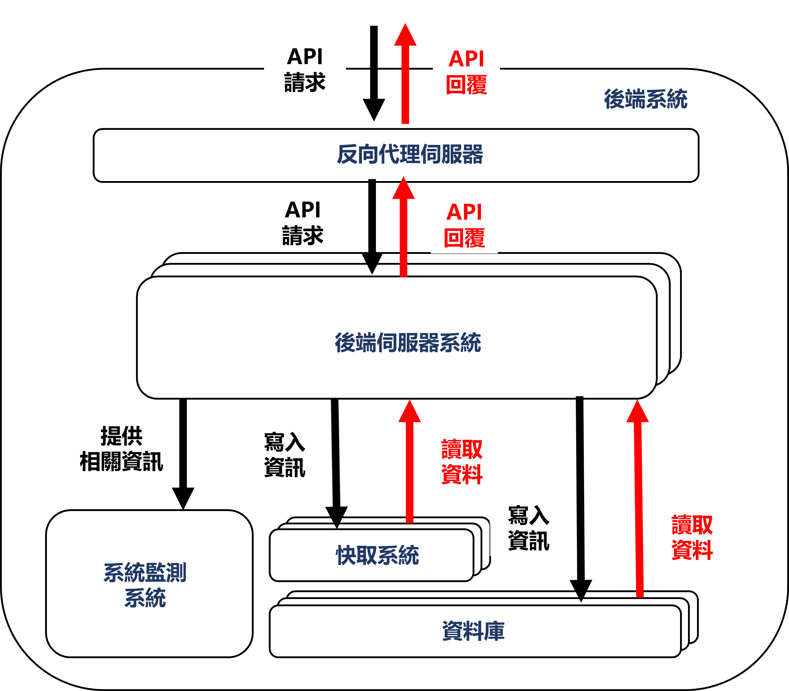

# 後端系統 - 廣告獲取與投遞
## 需求分析
### 人物狀態
1. 廣告投遞商
   ```
   為廣告的提供者，可以自行設計希望投遞的目標客群各種細節
   不過不會直接讓廣告商使用內部API，因為廣告宜先經過審核再由內部人員將廣告放置系統內
   ```
2. 管理者
   ```
   為系統管理者，預想狀態為廣告投遞商與管理者進行討論，
   確認投遞廣告項目與目標受眾後，將該項廣告資訊加入系統當中
   ```
3. 廣告接收者
   ```
   為一般使用人員，預想狀態透過查詢獲取其相關的廣告內容
   ```

### 需求項目
1. 新增廣告
   * ⽤於產⽣管理廣告資源 (僅為CREATE)
   * 使⽤ RESTful
   * 廣告屬性
     * 標題 Title
     * 開始與結束時間 StartAt、EdnAt
     * 年齡、性別、國家、平台 (Age、Gender、Country、Platform) (均為多選)
2. 查詢廣告
   * 列出符合條件的活躍廣告 (StartAt < NOW < EndAt)
   * 使⽤ RESTful
   * 具分頁功能 透過 offset & limit
   * 查詢參數 : Age、Gender、Country、Platform

```
備註 :
    RESTful 為一種API設計風格(路由即資源) 而通常使指http伺服器。
    因此該專案使用http作為整體後端的溝通協議。
```
```
備註 :
    在新增廣告環節當中，若是標題、開始時間、結束時間等等資訊都相同，是否該視為同一筆廣告。
    這項資訊關連到後續的資料庫設計。
    雖然題意無特別強調，不過我的答案是否定。我認為可能出現恰好資訊完全相同不同公司的狀態。
    為此呼應我後續的資料庫設計。
```

### 效能規範
Q、提供 Public API 能超過 10,000 Requests Per Second 的設計

首先對於每秒10000則請求，相信當中**勢必會出現續多相同條件請求**，
因此系統宜採用**快取服務以達到同時更多相同的請求**，當中快取位置可放於反向代理伺服器或是後端系統。

再來假設已經對於資料獲取方式做優化仍無法達到要求，則應採取"**垂直擴展**"或是"**水平擴展**"。
1. 垂直擴展 則需要行能更強大的主機，於軟體設計較無法控制 
2. 水平擴展 則需要使用分散式技術，可以使用kubernetes的方式進行部屬，並連接多台主機以提升效能

最後對於系統使否能承受指定流量仍需要做測試採能知曉，所以必須撰寫其相關腳本，達到流量要求並且產生隨機的詢問內容。
(此項專案使用我個人熟悉的K6作為負載測試)

### 其餘規範

* 可以參考 API 範例，也能⾃⾏設計 API
  * 會基於題目所規範的API進行設計
* 如果需要，請隨意使⽤任何外部函式庫
  * 基於安全考量與各項題目要求會使用gin作為伺服器框架，同時會使用多種連接各項資料庫的相關套件。
* ⾃由選擇外部儲存⽅式
  * 對於各項資訊儲存會採用不同方式
* 請對這兩組 API 進⾏合理的參數驗證和錯誤處理
  * 為此在middleware時會建立其相關檢查機制，並對其做相關處理。
* 請撰寫適當的 test
  * 為此會新增test資料夾，做單元測試、API測試、各項負載測試
* 不需要考慮⾝份驗證
  * 好的。表示所有人均可透過API進行互動。
* 同時存在系統的總活躍廣告數量 (也就是 StartAt < NOW < EndAt) < 1000
  * 可以在投遞廣告時進行檢查，若是該時段數量已超過1000則拒絕該廣告投遞請求
* 每天 create 的廣告數量 不會超過 3000 個
  * 為此可以為每個廣告建立created_at屬性，用以檢查當日投遞廣告數量，同時為提高效能可以將今日以投遞數量放置快取當中，整體規畫路徑設計如下，
  1. 進來後先於快取檢查當日投遞廣告數量
  2. 進入資料庫 再次檢查今日投遞數量
  3. 若已超過3000則廣告，則拒絕該項請求，並同時更改快取資訊數量為資料庫紀錄數值
  4. 若低於3000則廣告，則新增該項請求內容，並同時更改快取資訊數量為資料庫紀錄數值
* 請在 Readme 中描述想法和設計上的選擇
  * 好的。

### 附加功能

Q、對於達到題目要求的設計

對於題目規範，若欲達成最合適設計，最佳解法為設計實驗並觀察其狀態。

為此必須要建立其觀測系統以記錄並觀察數據，因此會於外增加Grafana、Prometheus、Influxdb等等工具，以觀測實驗成效。

## API 設計

由於是採用RESTful設計風格進行設計，因此使用OPENAPI(舊為Swagger)作為API規範文件非常合適。

[API文檔內容](api_specification.yaml)

```
備註 :
    此次開發採用文檔先行的方式，先設計文檔再撰寫後端程序內容。
```

## 資料庫設計
### Schema Diagram 設計

```
備註 :
    透過schema diagram實體的關聯性並不大，
    (雖然可以透過再增加其他實體以使advertisement成多對多關係，不過我認為意義並不大因此未採用)
    由此也可以嘗試使用no-sql的方式進行儲存(最後透過實驗才能得知何者才是相對最好的實現)
```
### Document Storage 設計
```
{
    "id": "Example Id",
    "title": "Example Title",
    "createdAt" : ISODate("2023-01-01T00:00:00Z"),
    "timeRange": {
        "startAt": ISODate("2023-01-01T00:00:00Z"),
        "endAt": ISODate("2023-01-02T00:00:00Z")
    },
    "conditions": {
        "age": {
            "ageStart": ISODate("2023-01-01T00:00:00Z"),
            "ageEnd": ISODate("2023-01-02T00:00:00Z")
        },
        "gender" : ["M","F"],
        "platform" : ["andriod","ios","web"],
        "country" : ["TW","JP"]
    }
}
```


### Cache 設計

我有在思考對於cache設計非常重要，

首先必須了解資料是否常更動，相對擔心"**快取擊穿**"、"**快取穿透**"、"**快取雪崩**"等等問題

而這一切又與使用者習慣有很大關係，比如可能前10筆資料會大量被請求，對於不同資料當中又可以做快取分層或是預熱資訊等等

而要如何獲得數據呢? 最佳便是透過實驗獲取最好的實現方式。

另外對於題意中有一筆規範中，單一時間內最多只擁有1000筆資訊。

是否能先把當前時間內的所有廣告直接存入快取。更新快取時間
1. 當新的廣告進行投遞時，若是時間位於有效時間內，則更新快取資訊。
2. 當快取中第一筆資訊endAt時間過期，則更新快取(資料由endAt進行排序)

```
[
    {
        "id" : "Example Id",
        "endAt" : ISODate("2023-01-02T00:00:00Z")
    },
    {
        "id" : "Example Id",
        "endAt" : ISODate("2023-01-02T00:00:00Z")
    }
]
```

而有其他檢索條件根據快取再進行查詢，並使用原本資訊(FIELD語法)進行排序。

```
備註 :
    此外還會額外使用反向代理伺服器，對於相同路由的請求會使用自身的快取進行回應。
    (代表同樣的請求內容在短間內可以直接回覆，不必重新查詢)
    但是對於後端仍會做快取設計。
```

### Key-Value Based Storage 設計
```
哈希表
    Key : 2023-02-12 (當日日期)
    Value : 1 (次數)
    (同時設定隔日哈希表過期)
```

## 專案架構與系統架構設計
### 專案設計 - [階層式架構](https://en.wikipedia.org/wiki/Multitier_architecture#Three-tier_architecture)


```markdown
Project Architecture

├── api
│   ├── handler
│   ├── middleware
│   ├── request
│   ├── response
│   ├── routes
│
├── internal
│   ├── repository
│   ├── service
│
├── templates
│
├── test
│
├── docs
│
├── go.mod
├── go.sum
│
├── main.go
```
- Presentation Layer
  - api 資料夾下，routes、handler與middleware
- Business Logic Layer
  - internal 資料夾下，service代表一系列邏輯服務
- Data Access Layer
  - internal 資料夾下，repository將與資料互動程序都放這
```
備註 :
    test 資料夾內放置一系列測試檔案
    templates 資料夾內放置靜態文件
    docs 資料夾內放置相關文檔
```
### 系統架構設計

1. 反向代理伺服器
```可以作為快取與附載均衡器的作用```
2. 後端伺服器
```主要作用為處理一系列邏輯處理，通訊協議採用http```
3. 系統監測系統
```透過grafana、proetheus、influxdb等等資料進行分析與呈現```
4. 快取系統
```透過此系統提升查詢時間，減輕查詢資料庫壓力```
5. 資料庫
```為實際資料存處位置```

```
備註 :
    為方便開發會先透過docker-compose確保系統可運作，後續新增kubernetes的部署
    資料庫當中，
        在關聯式資料庫會採用主從式架構 達成讀寫分離。
        在非關聯式資料庫採用集群的方式，以提升查詢效能。
```

